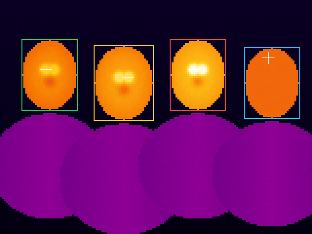
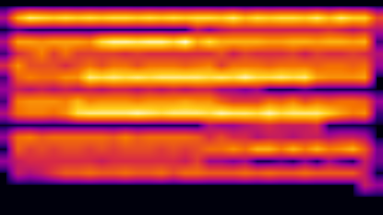
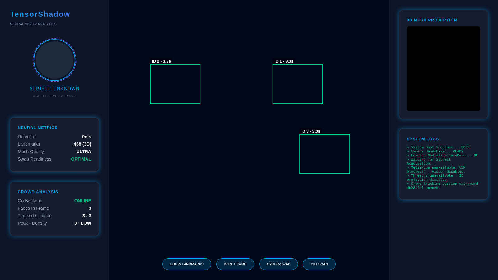
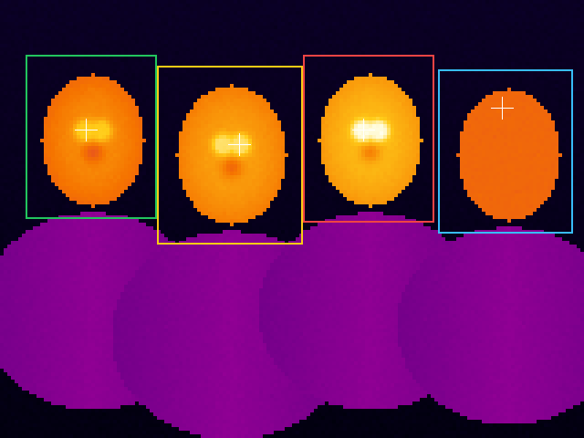

# TensorShadow Platinum

[](https://opensource.org/licenses/MIT)
[](https://go.dev/)
[](https://www.python.org/)
[](https://mediapipe.dev/)
[](https://threejs.org/)
[](api/openapi.yaml)

**TensorShadow** is an enterprise-grade biometric intelligence platform. It combines deep neural networks and real-time computer vision for facial analysis, ocular tracking and dental metrics. A **high-concurrency Go backend** adds **infrared (IR) thermal screening** and **multi-subject crowd analytics**.

---

## 💎 Key Features

- **Tricolour Biometric Segmentation:**
  - 🟠 **Orange Matrix:** 468-point high-density facial topography.
  - 🔵 **Blue Ocular Points:** High-precision iris and pupil tracking.
  - 🟢 **Green Maxillary Scan:** Real-time dental and oral geometry analysis.
- **Neural Demographic Estimation:** Deep-learning-based age and gender estimation with live confidence scoring.
- **Subject-Specific ML Training:** A manual calibration mode that locks neural weights to a specific face for higher accuracy.
- **3D Neural Projection:** Live WebGL/Three.js volumetric output showing real-time Z-depth and head orientation.
- **Enterprise UI:** A professional dashboard with millisecond latency monitoring and biometric data export.

### 🆕 New in v2.0
- ⚡ **Go High-Concurrency Backend:**
  - A bounded worker pool with back-pressure (503 + `Retry-After`), per-IP rate limiting and per-job timeouts.
  - Prometheus metrics and graceful shutdown.
  - **~11,800 tracking frames/s** on 4 vCPUs.
- 🌡️ **Infrared Thermal Biometrics:**
  - Radiometric decoding, including raw FLIR Lepton `uint16` buffers.
  - Emissivity correction.
  - Multi-face segmentation.
  - **Inner-canthus fever screening.**
  - **Thermal liveness / anti-spoofing.**
  - False-colour rendering.
- 👥 **Multi-Subject Tracking & Crowd Analysis:**
  - A Kalman + Hungarian tracker with stable IDs.
  - Tripwire in/out counting.
  - Zone occupancy and capacity alarms.
  - Density levels, crowd flow, dwell time and occupancy heatmaps.
  - A live SSE stream.
  - The dashboard now tracks **up to 6 faces** at once.

### 🆕 New in v2.1
- 🧠 **Production Model Serving:**
  - `/api/v1/predict` runs on **TensorFlow Serving** or **ONNX Runtime** (Open Inference Protocol v2: Triton, KServe or the bundled server), with timeouts, retries, a circuit breaker and graceful fallback.
  - Both formats are exported from one trained model, and their outputs agree to within 1.2×10⁻⁷.
- 🔁 **DeepSORT-Style Re-Identification:**
  - Appearance embeddings keep identities through long occlusions.
  - Behind a pillar that hides people for up to 40 frames, **IoU-only tracking counts 0 of 1,184 line crossings; ReID counts all 1,184.**
- 🎯 **Visible/IR Co-Registration:**
  - A calibrated homography maps RGB face-detector boxes into the thermal image.
  - The calibration error here is 0.2 px, and every temperature reading links back to the RGB detection it came from.

---

## 🏗️ Architecture

```text
 Browser dashboard ──(face boxes)──┐        ┌──────────── Go backend ────────────┐
 IR cameras (raw uint16 / JSON) ───┼──────► │ middleware: request-ID · logging · │
 CCTV person detectors ────────────┘        │ CORS · rate limit · body limit     │
                                            │            ▼                        │
                                            │ bounded worker pool (back-pressure)│
                                            │     ▼                     ▼        │
                                            │ internal/thermal   internal/tracking│
                                            │ RGB→IR coreg ROIs  Kalman · ReID    │
                                            │ ε-correction       appearance +     │
                                            │ canthus · liveness IoU Hungarian    │
                                            │            ▼                        │
                                            │ JSON · PNG · SSE · /metrics         │
                                            │ internal/inference ──► TF Serving   │
                                            │  breaker · fallback ─► ONNX Runtime │
                                            └─────────────────────────────────────┘
```

- **Neural Engine:** MediaPipe FaceMesh (multi-face) + TensorFlow.js.
- **Visualiser:** Three.js 3D rendering + Canvas 2D overlay with live track IDs.
- **Backend:** Go `net/http` service with a worker pool, zero-dependency Prometheus metrics and an embedded dashboard. The Flask server remains as a front-end prototype.
- **Model Serving:** a Keras DNN exported to a TF SavedModel (TensorFlow Serving) and to ONNX (ONNX Runtime), behind a resilient Go inference client.
- **ML Pipe:** Scikit-Learn MLP fallback for localised "on-the-fly" training.

The full design is in [`docs/ARCHITECTURE.md`](docs/ARCHITECTURE.md), and every endpoint is specified in [`api/openapi.yaml`](api/openapi.yaml).

---

## 📁 Project Structure

```text
TensorShadow/
├── api/openapi.yaml          # OpenAPI 3 spec (kept in sync with the router by a test)
├── clients/python/           # Dependency-free Python client
├── configs/config.yaml       # Server, concurrency, thermal and tracking settings
├── data/                     # Training datasets and stats
├── docs/                     # Architecture notes and generated output images
├── go_backend/
│   ├── main.go               # Server entrypoint (graceful shutdown)
│   ├── cmd/tsdemo/           # End-to-end feature walkthrough
│   ├── cmd/tsload/           # Closed-loop HTTP load generator
│   ├── internal/
│   │   ├── workerpool/       # Bounded pool with back-pressure
│   │   ├── thermal/          # IR decoding, screening, liveness, rendering
│   │   ├── tracking/         # Multi-subject tracker, ReID + crowd analytics
│   │   ├── inference/        # TF Serving / ONNX Runtime client, breaker, fallback
│   │   ├── coreg/            # Visible/IR homography calibration
│   │   ├── server/           # HTTP API, middleware, SSE
│   │   ├── metrics/          # Prometheus exposition
│   │   ├── config/  colormap/  sim/
│   ├── web/index.html        # Dashboard (embedded in the Go binary)
│   └── sim_server.py         # Flask prototype serving the same dashboard
├── r_analysis/               # Statistical reporting scripts
├── tensorflow_model/         # ML training, model export and serving
│   ├── export_models.py      # Train → SavedModel + ONNX (with parity check)
│   ├── onnx_server.py        # ONNX Runtime, Open Inference Protocol v2
│   ├── serving/tensorshadow/1/        # SavedModel for TensorFlow Serving
│   └── onnx/tensorshadow/1/model.onnx # ONNX model
├── Dockerfile  Makefile  requirements.txt
```

---

## 🚀 Quick Start

### 1. Prerequisites
- Go 1.22+ (backend)
- Python 3.9+ and pip (ML tooling, Flask prototype)

### 2. Run the Go backend and dashboard
```bash
cd TensorShadow
go run ./go_backend            # or: make build && ./bin/go_backend
```
Open **http://localhost:8080** in your browser. The dashboard connects to the crowd-tracking API automatically and labels every face with a persistent ID.

Useful flags and settings: `-addr :9090`, `-log-level debug`, `-config path.yaml`. The environment variables `TS_PORT`, `TS_WORKERS`, `TS_QUEUE_SIZE` and `TS_RATE_LIMIT_RPS` override the config file.

### 3. See every feature in 5 seconds
```bash
make demo        # runs go_backend/cmd/tsdemo against the running server
```

### 4. Python tooling (unchanged)
```bash
pip install -r requirements.txt
python go_backend/sim_server.py   # front-end-only prototype (no Go APIs)
```

### 5. Serve the ML model (TensorFlow Serving or ONNX Runtime)
```bash
make serve-tf        # TensorFlow Serving in Docker on :8501
make serve-onnx      # or: ONNX Runtime server on :8001 (pip install onnxruntime numpy)

TS_INFERENCE_BACKEND=tfserving   TS_INFERENCE_URL=http://localhost:8501 go run ./go_backend
TS_INFERENCE_BACKEND=onnxruntime TS_INFERENCE_URL=http://localhost:8001 go run ./go_backend
```
`make models` retrains and re-exports both artefacts. `make live-test` checks that the two servers agree.

### 6. Docker
```bash
docker build -t tensorshadow . && docker run -p 8080:8080 tensorshadow
```

---

## 🧠 Usage Examples

### ML Calibration
Use the **Calibration Panel** on the left to train the model to your specific face for better age and gender accuracy.

### 3D Volumetric Scan
The right panel shows a live rotating point cloud of your facial structure. Turn your head to see depth sensing in action.

### Infrared thermal screening
Upload a radiometric frame. The most efficient format is a raw FLIR Lepton-style buffer of little-endian `uint16` centikelvin values:
```bash
curl -X POST -H 'Content-Type: application/octet-stream' --data-binary @frame.bin \
  'http://localhost:8080/api/v1/thermal/analyze?width=160&height=120&ambient_c=22'

# False-colour PNG with status boxes and canthus crosshairs
curl -X POST -H 'Content-Type: application/octet-stream' --data-binary @frame.bin -o thermal.png \
  'http://localhost:8080/api/v1/thermal/render?width=160&height=120&palette=ironbow&scale=4&annotate=true'
```
JSON input also works (`{"width":160,"height":120,"format":"celsius","data":[…]}`), as do the `kelvin` and `raw16` (with `gain`/`offset`) formats.

### Multi-subject crowd tracking
Open one session per camera, then post each frame's detections (from MediaPipe, YOLO or any detector):
```bash
curl -X POST localhost:8080/api/v1/crowd/sessions -H 'Content-Type: application/json' -d '{
  "id": "lobby-cam-1", "frame_width": 1280, "frame_height": 720, "area_m2": 60,
  "lines": [{"id": "gate", "a": {"x": 640, "y": 0}, "b": {"x": 640, "y": 720}}],
  "zones": [{"id": "queue", "capacity": 10,
             "polygon": [{"x":0,"y":0},{"x":640,"y":0},{"x":640,"y":720},{"x":0,"y":720}]}]}'

curl -X POST localhost:8080/api/v1/crowd/sessions/lobby-cam-1/frames -H 'Content-Type: application/json' \
  -d '{"detections": [{"bbox": {"x": 600, "y": 200, "w": 60, "h": 150}, "score": 0.94, "label": "person"}]}'

curl -N localhost:8080/api/v1/crowd/sessions/lobby-cam-1/stream        # live SSE feed
curl -o heat.png 'localhost:8080/api/v1/crowd/sessions/lobby-cam-1/heatmap?format=png'
```

### Model inference
```bash
curl -X POST localhost:8080/api/v1/predict -H 'Content-Type: application/json' \
  -d '{"data": [0.4, -0.2, 0.1, 0.3, -0.5, 0.2, 0.0, 0.6, -0.1, 0.3]}'
# → {"status":"success","result":0.71467,"class":1,"outputs":[0.28533,0.71467],
#    "backend":"onnxruntime","model":"tensorshadow","version":"1","latency_ms":…}

curl -X POST localhost:8080/api/v1/predict -d '{"instances": [[…10 features…], […]]}'   # batch
curl localhost:8080/api/v1/model                                                    # readiness + counters
```

### Re-identification after occlusion
Add an appearance `embedding` (from OSNet/FastReID, ArcFace or any ReID model; any length up to 2048) to each detection. Tracks then keep their ID for up to `reid_max_age` frames unseen:
```json
{"detections": [{"bbox": {"x": 600, "y": 200, "w": 60, "h": 150}, "score": 0.94,
                 "embedding": [0.021, -0.113, 0.087, "…"]}]}
```

### Visible/IR co-registration
Calibrate once from heated-target corners seen by both cameras, then send the **RGB** face boxes with each thermal frame:
```bash
curl -X POST localhost:8080/api/v1/coreg/rigs -H 'Content-Type: application/json' -d '{
  "id": "gate-1", "visible": {"width": 1280, "height": 960}, "thermal": {"width": 160, "height": 120},
  "points": [{"visible": {"x": 200, "y": 150}, "thermal": {"x": 29.6, "y": 17.4}}, …]}'

curl -X POST -H 'Content-Type: application/octet-stream' --data-binary @frame.bin \
  'localhost:8080/api/v1/thermal/analyze?width=160&height=120&rig=gate-1&vbox=674,163,225,296,track-17'
```
Each subject in the response carries `visible_roi.id` (`track-17`), which joins the temperature back to the RGB track.

### Python client
```python
from tensorshadow_client import TensorShadowClient   # clients/python/
ts = TensorShadowClient("http://localhost:8080")
result = ts.thermal_analyze_raw(buffer, width=160, height=120, ambient_c=22.0)
ts.create_session("lobby-cam-1", 1280, 720, area_m2=60)
frame = ts.post_frame("lobby-cam-1", [{"bbox": {"x": 600, "y": 200, "w": 60, "h": 150}}])
pred = ts.predict([0.4, -0.2, 0.1, 0.3, -0.5, 0.2, 0.0, 0.6, -0.1, 0.3])
ts.create_rig("gate-1", (1280, 960), (160, 120), points)
res = ts.thermal_analyze_coregistered(buffer, 160, 120, "gate-1", [{"x": 674, "y": 163, "w": 225, "h": 296, "id": "track-17"}])
```

### API overview

| Method | Endpoint | Purpose |
|---|---|---|
| `GET` | `/api/v1/health` | Liveness probe |
| `GET` | `/api/v1/stats` | Runtime, pool, latency and crowd statistics |
| `GET` | `/metrics` | Prometheus metrics |
| `POST` | `/api/v1/predict` | Model inference: TF Serving, ONNX Runtime or baseline (single or batch) |
| `GET` | `/api/v1/model` | Model backend readiness, versions and counters |
| `POST` | `/api/v1/thermal/analyze` | Segment, screen and liveness-check all faces |
| `POST` | `/api/v1/thermal/render` | False-colour PNG (ironbow, rainbow, whitehot, blackhot) |
| `POST/GET` | `/api/v1/crowd/sessions` | Create or list tracking sessions |
| `GET/DELETE` | `/api/v1/crowd/sessions/{id}` | Describe or close a session |
| `POST` | `/api/v1/crowd/sessions/{id}/frames` | Ingest detections → tracks + analytics |
| `GET` | `/api/v1/crowd/sessions/{id}/analytics` | Latest analytics snapshot |
| `GET` | `/api/v1/crowd/sessions/{id}/heatmap` | Occupancy heatmap (JSON or `?format=png`) |
| `GET` | `/api/v1/crowd/sessions/{id}/stream` | Live Server-Sent Events |
| `POST/GET` | `/api/v1/coreg/rigs` | Calibrate or list visible/IR rigs |
| `GET/DELETE` | `/api/v1/coreg/rigs/{id}` | Describe or delete a rig |
| `POST` | `/api/v1/coreg/rigs/{id}/map` | Map RGB boxes into thermal pixels |

---

## 📊 Outputs

Every output below was produced by the code in this repository. The scenes are synthetic and generated with known ground truth (`go_backend/internal/sim`), so accuracy is measured rather than estimated. Timings were taken on a **4 vCPU Intel Xeon @ 2.1 GHz** cloud container with Go 1.24, and the load generator ran **on the same machine**, so the throughput figures are conservative.

### 1. Infrared thermal screening (`make demo`)

The reference frame is a 160×120 radiometric image of three real faces at different body temperatures plus one **heated spoof** (a warmed mask/screen at a skin-like 33.5 °C):

```text
━━ Infrared thermal screening ━━━━━━━━━━━━━━━━━━━━━━━━━━━━━━━━━━━━━━━━━━━━━━
Frame 160x120  range 21.86–38.65 °C  ambient 22.0 °C (provided)  ε=0.98  processed in 1.51 ms

Subject  ROI (x,y,w,h)  Skin mean  Canthus   Truth     Core est.  Status         Liveness
#0       11,20,29,37    34.29 °C   36.62 °C  36.60 °C  36.92 °C   NORMAL         LIVE (1.00)
#1       48,23,31,39    34.88 °C   37.40 °C  37.40 °C  37.70 °C   ELEVATED       LIVE (1.00)
#2       87,20,29,37    35.72 °C   38.52 °C  38.50 °C  38.82 °C   FEVER          LIVE (1.00)
#3       125,24,29,37   33.50 °C   33.56 °C  spoof     33.86 °C   INDETERMINATE  SPOOF (0.50): facial_thermal_gradient, periorbital_hotspot
```

The measured canthus temperature is within **0.02 °C** of ground truth for every real face. The spoof passes the temperature-range checks but is caught because it has no facial thermal gradient and no periorbital hotspot.

<p align="center">
  
  <br><em><code>POST /api/v1/thermal/render?palette=ironbow&amp;annotate=true</code>. Box colours: 🟩 normal · 🟨 elevated · 🟥 fever · 🟦 spoof suspected. The crosshair marks the measured inner canthus.</em>
</p>

<details>
<summary>Sample <code>/thermal/analyze</code> response (fever subject, from a raw <code>uint16</code> centikelvin upload)</summary>

```json
{
  "roi": { "x": 87, "y": 20, "w": 29, "h": 37 },
  "skin": { "pixels": 785, "min_c": 34.36, "max_c": 38.65, "mean_c": 35.72, "std_c": 0.75, "p50_c": 35.55, "p90_c": 36.29 },
  "canthus": { "x": 99, "y": 35, "temp_c": 38.52 },
  "core_estimate_c": 38.82,
  "status": "fever",
  "liveness": {
    "live": true, "score": 1,
    "checks": [
      { "name": "physiological_skin_range", "passed": true, "value": 35.72, "limit": "31.0–38.5 °C" },
      { "name": "facial_thermal_gradient",  "passed": true, "value": 3.46,  "limit": ">= 1.5 °C (p98−p2)" },
      { "name": "periorbital_hotspot",      "passed": true, "value": 2.97,  "limit": ">= 0.30 °C above facial median" },
      { "name": "ambient_contrast",         "passed": true, "value": 13.72, "limit": ">= 4 °C above ambient" }
    ]
  }
}
```
</details>

### 2. Multi-subject tracking & crowd analysis (`make demo`)

The reference scene is 720p at 10 FPS with 24 pedestrians walking in both directions. Detections include 1.5 px localisation jitter and 3 % missed detections. A tripwire sits at the centre gate and a capacity-10 zone covers the west concourse.

```text
━━ Multi-subject tracking & crowd analysis ━━━━━━━━━━━━━━━━━━━━━━━━━━━━━━━━━━
frame  60  active  6  unique  6  gate in/out  0/0   west zone  5  density 0.10/m² (low)  flow east
frame 120  active 14  unique 14  gate in/out  2/0   west zone  5  density 0.23/m² (low)  flow stationary
frame 180  active 22  unique 23  gate in/out  6/3   west zone  8  density 0.37/m² (low)  flow west
frame 240  active 17  unique 24  gate in/out  9/9   west zone 10  density 0.28/m² (low)  flow west
frame 300  active  9  unique 24  gate in/out 12/12  west zone  5  density 0.15/m² (low)  flow west

300 frames posted, mean round-trip 0.60 ms/frame

Metric                    Tracker  Ground truth
Unique subjects           24       24
Peak simultaneous         23       23
Gate crossings L→R (in)   12       12
Gate crossings R→L (out)  12       12
West zone entries / peak  24 / 13  –
Avg dwell (completed)     16.27 s  –
```

"Flow stationary" at frame 120 is correct: two equal crowds walking in opposite directions cancel out, and the API reports this through the `coherence` field.

<p align="center">
  
  <br><em><code>GET /api/v1/crowd/sessions/{id}/heatmap?format=png</code>: occupancy accumulated over 300 frames. The walking lanes are clearly visible.</em>
</p>

**Accuracy across 50 randomised scenes** (`TestAccuracyAcrossSeeds`, enforced in CI):

| Metric | Result |
|---|---|
| Tripwire crossings counted correctly | **1,200 / 1,200 (100 %)** |
| Identities correct (no ID switch or fragmentation) | **1,199 / 1,200 (99.9 %)** |

<details>
<summary>Sample <code>/frames</code> response (4th frame of two people; one has just crossed the gate)</summary>

```json
{
  "session_id": "lobby-cam-1", "frame": 4, "timestamp": "2026-09-25T10:00:03Z",
  "tracks": [
    { "id": 1, "state": "confirmed", "bbox": { "x": 623.98, "y": 200, "w": 60, "h": 150 },
      "center": { "x": 653.98, "y": 275 }, "velocity": { "x": 7.993, "y": 0 },
      "age_frames": 4, "hits": 4, "dwell_seconds": 3, "score": 0.94, "label": "person" },
    { "id": 2, "state": "confirmed", "bbox": { "x": 200, "y": 300, "w": 58, "h": 148 },
      "center": { "x": 229, "y": 374 }, "velocity": { "x": 0, "y": 0 },
      "age_frames": 4, "hits": 4, "dwell_seconds": 3, "score": 0.88, "label": "person" }
  ],
  "analytics": {
    "active_subjects": 2, "unique_subjects": 2, "peak_subjects": 2, "frames_processed": 4,
    "density": { "per_m2": 0.033, "coverage_ratio": 0.019, "level": "low", "basis": "persons_per_m2" },
    "flow": { "mean_vx": 3.997, "mean_vy": 0, "speed_px_per_frame": 3.997, "heading_deg": 0, "direction": "east", "coherence": 1 },
    "dwell": { "active_avg_seconds": 3, "active_max_seconds": 3, "completed_avg_seconds": 0, "completed_tracks": 0 },
    "lines": [ { "id": "gate", "in": 1, "out": 0, "net": 1 } ],
    "zones": [ { "id": "queue", "occupancy": 1, "peak": 1, "entries": 1, "capacity": 10, "utilisation": 0.1, "over_capacity": false } ]
  }
}
```
</details>

### 3. Dashboard multi-subject mode

<p align="center">
  
  <br><em>Headless-browser capture of the dashboard served by the Go backend. The sandbox had no camera and no CDN access, so synthetic face landmarks were fed through the dashboard's own <code>crowdSubmit()</code> path. The IDs and dwell times come from the Go tracker, and the page reports disabled 3D and vision features instead of crashing.</em>
</p>

### 4. Model serving: TensorFlow Serving and ONNX Runtime

`export_models.py` trains the DNN (held-out accuracy 92.0 % on its synthetic 10-feature task) and exports the same weights twice:

```text
held-out accuracy: 0.9200 (1200 samples)
SavedModel  -> tensorflow_model/serving/tensorshadow/1
ONNX        -> tensorflow_model/onnx/tensorshadow/1/model.onnx
TF vs ONNX Runtime max |diff| over 256 samples: 1.19e-07
```

Both were served by **real** servers: TensorFlow Serving 2.20 and ONNX Runtime 1.30 via `onnx_server.py`. The Go live test sent one batch through each and got identical answers:

```text
tfserving   results=[{Outputs:[0.28533 0.71467] Score:0.71467 Class:1} {Outputs:[0.817563 0.182437] Score:0.817563 Class:0}] status=AVAILABLE
onnxruntime results=[{Outputs:[0.28533 0.71467] Score:0.71467 Class:1} {Outputs:[0.817563 0.182437] Score:0.817563 Class:0}] status=AVAILABLE
```

**Resilience against a real outage.** The ONNX Runtime server was killed under the live backend, then restarted:

```text
1) healthy:                          backend=onnxruntime p=0.71467  degraded=False
2) server killed (requests 1–5):     backend=baseline    p=0.527472 degraded=True  dial tcp … connection refused
   request 6:                        backend=baseline    p=0.527472 degraded=True  circuit breaker open after repeated backend failures
3) restarted, still in cooldown:     backend=baseline    degraded=True  circuit breaker open …
4) after the 10 s cooldown:          backend=onnxruntime p=0.71467  degraded=False
```

**`/api/v1/predict` throughput** (32 clients, 10 s, one 10-feature vector per request, all backends on the same 4 vCPUs):

| Backend | Throughput | p50 | p90 | p99 | Errors |
|---|---:|---:|---:|---:|---:|
| TensorFlow Serving 2.20 | **6,599 req/s** | 4.50 ms | 7.45 ms | 11.07 ms | 0 |
| ONNX Runtime 1.30 (`onnx_server.py`) | 2,654 req/s | 10.69 ms | 20.85 ms | 33.95 ms | 0 |
| In-process baseline | 40,336 req/s | 0.51 ms | 1.65 ms | 4.56 ms | 0 |

The ONNX path is capped by the single Python process of the reference server (GIL). For production scale the same protocol runs unchanged against Triton's onnxruntime backend. Profiling this run also found a Nagle/delayed-ACK stall in the Python server; setting `TCP_NODELAY` raised its throughput from 708 to 2,654 req/s.

### 5. Re-identification through long occlusion (`make demo`)

The scene is the 720p pedestrian scene with a **200 px pillar over the counting line**, so everyone disappears for 22–40 frames, longer than `max_age` (15). Each detection carries a 128-d embedding (identity + noise at a 0.5 noise-to-signal ratio):

```text
Metric                                IoU only (SORT)  ReID (DeepSORT-style)  Ground truth
Unique identities                     45               24                     24
Line crossings counted                0                24                     24
Identities recovered after occlusion  0                24                     –
```

Over **50 randomised occluded scenes** (`TestReIDAcrossOcclusion`, enforced in CI):

| Metric | IoU only | ReID |
|---|---:|---:|
| Observable line crossings counted | 0 / 1,184 (0 %) | **1,184 / 1,184 (100 %)** |
| Identity errors (split IDs), out of 1,200 people | 1,126 | **5 (0.4 %)** |
| Identities recovered after occlusion | 0 | 1,184 |

The truth contains 1,200 crossings. 16 of them were made behind the pillar by people still hidden when the sequence ended; no tracker can observe those, so they are excluded. The unoccluded accuracy gate is unchanged (1,200/1,200 crossings), because detections without embeddings follow the exact SORT path.

**In the dashboard** (real browser, the dashboard's own colour-histogram embeddings): two people vanish for 30 frames and come back with their original IDs:

```text
before occlusion: [{"id":2,"x":177},{"id":1,"x":627}]
after occlusion:  [{"id":2,"x":279,"reidentified":1},{"id":1,"x":729,"reidentified":1}]
reid analytics:   {"enabled":true,"embedding_dim":128,"appearance_threshold":0.2,"recoveries":2} | unique: 2
```

### 6. Visible/IR co-registration (`make demo`)

A 1280×960 RGB camera and a 160×120 thermal camera are offset by a 1.2° roll, a few pixels of boresight shift and slight keystone. The rig is calibrated from 9 heated-target corners (0.2 px localisation noise). Thermal ROIs then come **only** from the RGB face detector's boxes:

```text
rig calibrated from 9 heated-target points: RMSE 0.199 px, max 0.289 px (good)

RGB detection  Visible box (x,y,w,h)  Thermal ROI   Canthus   Status         Liveness
rgb-face-1     67,172,229,290         7,15,36,45    36.62 °C  NORMAL         LIVE
rgb-face-2     360,196,249,312        43,18,40,49   37.40 °C  ELEVATED       LIVE
rgb-face-3     674,163,225,296        83,15,36,46   38.52 °C  FEVER          LIVE
rgb-face-4     974,184,233,292        120,19,37,45  33.56 °C  INDETERMINATE  SPOOF
```

The canthus readings match the automatically segmented analysis exactly, and each result carries its RGB detection ID.

<p align="center">
  
  <br><em><code>/thermal/render?annotate=true&amp;rig=…</code> with <code>visible_rois</code>. The boxes are the RGB detections projected into the thermal image, with the 10 % parallax margin.</em>
</p>

In unit tests the estimator recovers a noise-free homography to better than 10⁻⁶ px. With 0.25 px corner noise the maximum mapping error anywhere in the frame is under 0.6 px.

### 7. High-concurrency load tests (`go_backend/cmd/tsload`)

These are closed-loop tests of 15 s each, with the rate limiter disabled (`TS_RATE_LIMIT_RPS=0`) and default config (4 workers, queue 1024):

| Scenario | Clients | Throughput | p50 | p90 | p99 | Errors |
|---|---:|---:|---:|---:|---:|---:|
| Crowd tracking frames (12.5 detections avg) | 64 | **11,806 req/s** | 3.51 ms | 13.11 ms | 24.56 ms | 0 |
| Thermal 160×120, raw `uint16` (38 KB) | 32 | **1,927 req/s** | 15.92 ms | 22.42 ms | 30.63 ms | 0 |
| Thermal 160×120, JSON (356 KB) | 32 | 460 req/s | 50.08 ms | 153.65 ms | 286.88 ms | 0 |
| Mixed: 75 % crowd / 25 % thermal | 64 | 5,258 req/s | 10.72 / 13.56 ms | 18.81 / 22.56 ms | 28.72 / 33.59 ms | 0 |

After roughly 293,000 requests the server reported `errors_total: 0`, `rejected: 0` and 11 goroutines at rest (no leaks), and every load-test session had been cleaned up. Binary thermal ingest is **4.2× faster** than JSON.

Back-pressure and rate limiting were checked as well. With the default per-IP limit of 200 req/s, the same crowd test was answered with fast `429` + `Retry-After` responses (p50 1.0 ms). A saturated pool returns `503 overloaded` + `Retry-After: 1` (`TestBackpressureReturns503`).

### 8. Micro-benchmarks (`make bench`)

```text
BenchmarkAnalyze160x120-4        1400     912306 ns/op    651980 B/op     98 allocs/op
BenchmarkAnalyze640x480-4          63   20191488 ns/op  13295704 B/op    138 allocs/op
BenchmarkTrackerFrame-4         70488      18552 ns/op      9695 B/op    179 allocs/op
BenchmarkTrackerDense4K-4         462    2732267 ns/op    396.0 subjects/frame
BenchmarkTrackerReID-4          27565      42795 ns/op     20210 B/op    191 allocs/op
BenchmarkSubmit-4             1000000       1028 ns/op       144 B/op      2 allocs/op
```

`BenchmarkTrackerReID` measures a frame of the occluded scene with 128-d embeddings: 43 µs per frame including the appearance cascade.

| Workload | Before optimisation | After |
|---|---:|---:|
| Thermal analysis, 160×120 | 4.32 ms | **0.89 ms** (4.9×): no `math.Pow` on the hot path, O(n) median |
| Thermal analysis, 640×480 | 79.1 ms | **18.7 ms** (4.2×) |
| Tracker, dense 4K scene (396 subjects/frame) | 22.4 ms | **2.6 ms** (8.6×): gated, component-wise Hungarian |

### 9. Test suite (`make race`, `make cover`)

```text
ok   go_backend/internal/colormap     coverage: 93.3% of statements
ok   go_backend/internal/config       coverage: 74.1% of statements
ok   go_backend/internal/coreg        coverage: 88.6% of statements
ok   go_backend/internal/inference    coverage: 80.9% of statements
ok   go_backend/internal/metrics      coverage: 94.2% of statements
ok   go_backend/internal/server       coverage: 80.4% of statements
ok   go_backend/internal/thermal      coverage: 91.8% of statements
ok   go_backend/internal/tracking     coverage: 91.4% of statements
ok   go_backend/internal/workerpool   coverage: 88.9% of statements
```

All packages pass under the race detector, on both Go 1.22 and Go 1.24. The server suite also passed 100 consecutive stress runs. CI (`.github/workflows/ci.yml`) runs gofmt, vet and the race tests, then boots the binary and runs `tsdemo` and the Python client against it. A separate job starts real TensorFlow Serving and ONNX Runtime and runs the Go parity test against both.

---

## 🗺️ Roadmap
- [x] Implement Go-based high-concurrency backend.
- [x] Add Infrared (IR) support for thermal biometric scanning.
- [x] Integrate Multi-Subject tracking (Crowd Analysis).
- [x] Wire `/api/v1/predict` to TensorFlow Serving / ONNX Runtime.
- [x] Appearance embeddings (DeepSORT-style re-identification) for long occlusions.
- [x] Visible/IR co-registration to drive thermal ROIs from the RGB face detector.

✅ **All roadmap items are complete.**

> ⚠️ Thermal screening output is decision support, not a medical diagnosis. Production deployments need a blackbody reference source and site calibration of `thermal.core_offset_c`.

## 🤝 Contributing
Contributions are welcome! Please follow the corporate development guidelines in [CONTRIBUTING.md](CONTRIBUTING.md). Run `make lint race` before opening a pull request.

## 📄 License
This project is licensed under the MIT License.
